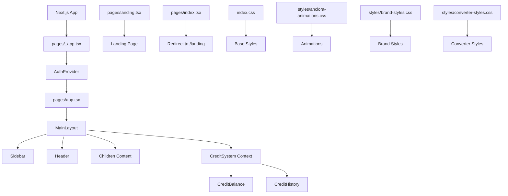

# Frontend Architecture Diagram

## Current Architecture



## Proposed Improved Architecture

```mermaid
graph TD
    A[Next.js App] --> B[pages/_app.tsx]
    B --> C[Providers Wrapper]
    C --> D[AuthProvider]
    C --> E[ThemeProvider]
    C --> F[CreditSystemProvider]
    
    G[pages/app.tsx] --> H[AppLayout]
    H --> I[EnhancedSidebar]
    H --> J[EnhancedHeader]
    H --> K[MainContentRouter]
    
    L[Component Structure] --> M[Layout Components]
    L --> N[UI Components]
    L --> O[Feature Components]
    
    P[State Management] --> Q[Context Providers]
    P --> R[Custom Hooks]
    P --> S[Redux Toolkit]
    
    T[Performance] --> U[Code Splitting]
    T --> V[Lazy Loading]
    T --> W[Optimized Animations]
    
    X[Testing] --> Y[Unit Tests]
    X --> Z[Integration Tests]
    X --> AA[E2E Tests]